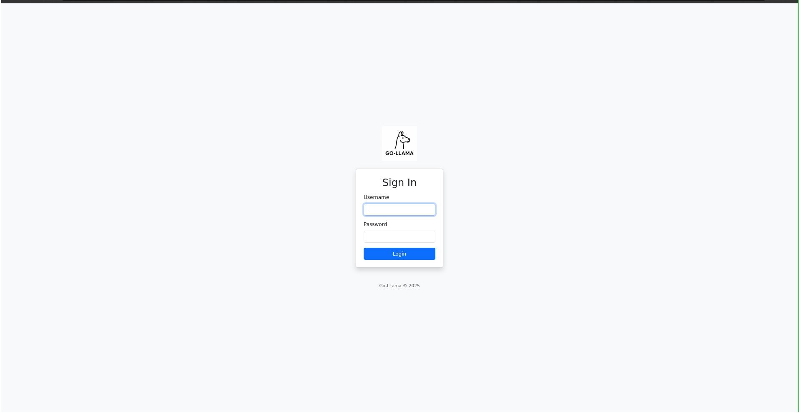
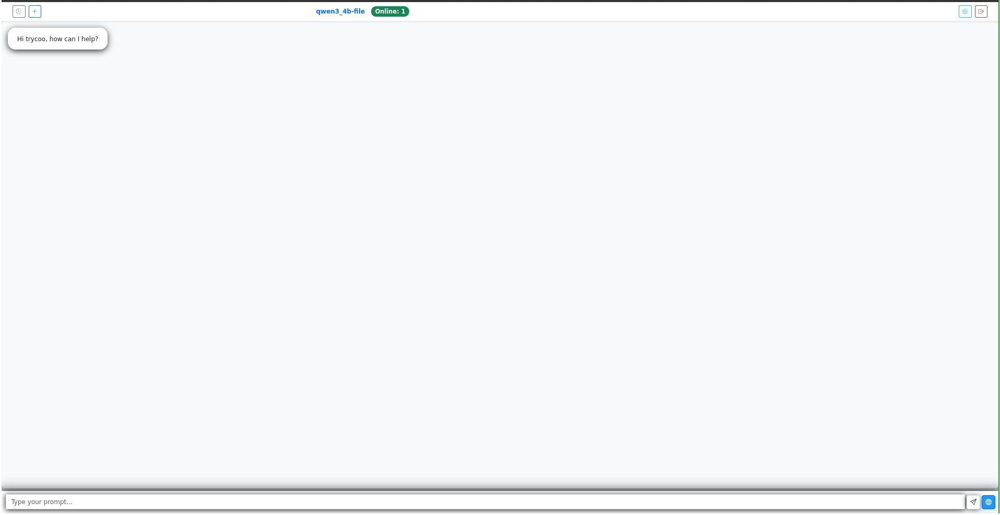
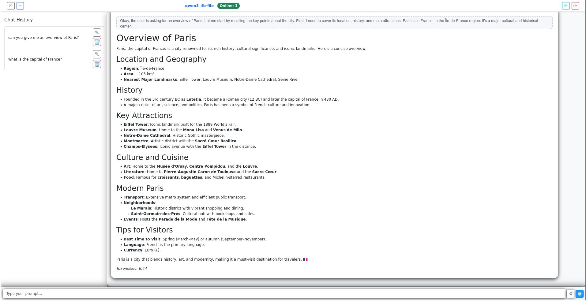
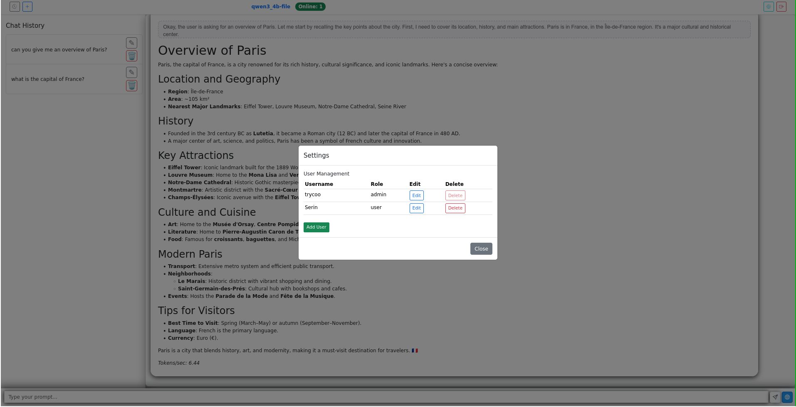
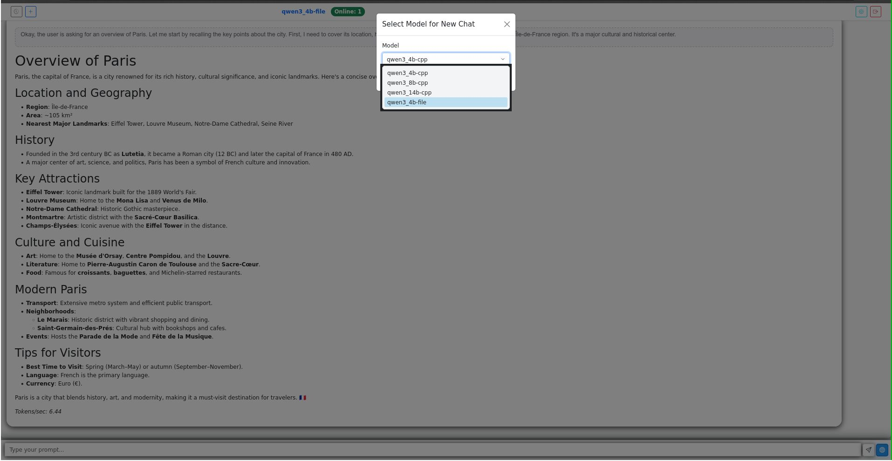

# README.md
# Go-LLama


---

## Modern Local LLM Chat Web App

Go-LLama is a fully self-hosted, modern chat UI for local LLMs (llama.cpp/llamafile), featuring user authentication, persistent chat history, live streaming, and optional web search via SearxNG.  
**Deploy on your own hardware, scale as needed, and keep your data private.**

---

## Features

- **Local LLM chat:** Connects to llama.cpp/llamafile and compatible APIs.  
- **User authentication:** JWT-based login, admin/user roles, session expiry.
- **Persistent chat history:** Each user gets private chat history, can rename/delete chats.
- **Live streaming:** WebSocket-powered, tokens/sec display, stop button.
- **Web search integration:** Toggle SearxNG results in chat for up-to-date answers.
- **⚡️ Smart auto-web-search (NEW):**  
  - Automatically detects when online results are needed  
  - Works silently — UI stays clean  
  - Manual toggle still available
- **🌐 Auto-search indicator (NEW):**  
  - Shows a tiny `🌐 auto-search` hint when the model triggered search on its own
- **User management:** Admins can add/edit/delete users; users manage their own accounts.
- **Responsive front-end:** Bootstrap UI, mobile-friendly, tooltips, icons, transitions.
- **Configurable subpath:** Deploy under any subpath (default: `/go-llama`).
- **Dockerized database & cache:** PostgreSQL, Redis, and backend via Docker Compose.
- **OpenAPI spec:** See [openapi/openapi.yaml](openapi/openapi.yaml) for full API documentation.

---












---

## Quickstart (Dockerized Deployment)

1. **Clone this repo:**
    ```sh
    git clone https://github.com/TheFozid/go-llama.git
    cd go-llama
    ```

2. **Copy & edit config:**
    ```sh
    cp config.sample.json config.json
    # Edit config.json for your setup (see comments inside)
    # For Docker Compose, use: host=postgres (not localhost) for database, addr=redis:6379 for Redis
    ```

3. **Build and start all services (backend, database, cache):**
    ```sh
    docker compose up --build -d
    ```

4. **Open in browser:**  
   Visit [http://localhost:8070/go-llama](http://localhost:8070/go-llama) (or your configured subpath).

---

## Reverse Proxy Example (Nginx)

To expose Go-LLama securely or behind a custom domain, you can use a **single location block** for all web app traffic:

```nginx
location /go-llama {
    proxy_pass http://localhost:8070/go-llama;
    proxy_set_header Host $host;
    proxy_set_header X-Real-IP $remote_addr;
    proxy_set_header X-Forwarded-For $proxy_add_x_forwarded_for;
    proxy_set_header X-Forwarded-Proto $scheme;
    proxy_http_version 1.1;
    proxy_set_header Upgrade $http_upgrade;
    proxy_set_header Connection "upgrade";
    proxy_read_timeout 600s;
    proxy_send_timeout 600s;
    proxy_connect_timeout 600s;
    proxy_buffering off;
    proxy_request_buffering off;
    chunked_transfer_encoding on;
}
```

- This setup proxies all requests to `/go-llama` and its subpaths (like `/go-llama/static/...`) to your backend.
- Make sure your backend config `subpath` is set to `/go-llama`.
- For HTTPS, also set up SSL/TLS as usual.

---

## Auto-Web-Search Feature (NEW)

Go-LLama can now intelligently detect queries that need fresh web data, such as:

- "Who is the prime minister of the UK?"
- "Latest NVIDIA driver version"
- "Exchange rate GBP to USD"

Behavior:

| User Toggle | Auto Logic | UI |
|------------|------------|----|
OFF | AI silently checks + may search | “Thinking…” + small 🌐 badge |
ON | Always search (existing behavior) | “Searching…” → “Thinking” |

No loops, no agent chat — works on tiny models.

---

## Documentation

- [Setup Guide](SETUP.md)
- [Manual Testing](MANUAL_TESTING.md)
- [Security Hardening](HARDENING.md)
- [API Spec](openapi/openapi.yaml)
- [Project State & Progress](PROJECT_STATE.md)
- [Code Review Tracker](CODE_REVIEW_TRACKER.md)

---

## Updating Go-LLama

### Update code & container images

```sh
cd go-llama
git pull
docker compose down
docker compose up --build -d
```

### Update without downtime

```sh
git pull
docker compose up --build -d
docker image prune -f
```

> Your database and chat history are preserved.

---

## Full Uninstall

> ⚠️ This deletes **all chats, users, and data**

### Docker install

```sh
docker compose down -v
docker image rm go-llama-backend
rm -rf config.json postgres redis
```

### Bare-metal install

```sh
sudo systemctl stop go-llama || true
rm -rf /opt/go-llama ~/.cache/go-llama ~/.config/go-llama
```

If you created a systemd service:

```sh
sudo rm /etc/systemd/system/go-llama.service
sudo systemctl daemon-reload
```

---

## Configuration

- See [`config.sample.json`](config.sample.json)
- **Do not commit `config.json` with secrets**
- For Docker Compose, use service names (`postgres`, `redis`) as hosts in `config.json`

---

## Troubleshooting

- **Frontend not loading?**  
  Ensure static files are included (see Dockerfile).
- **Database/Redis errors?**  
  Use `postgres` and `redis:6379` in Docker mode.
- **Check logs:**  
  ```sh
  docker compose logs go-llama-backend
  ```

---

## License

MIT License (see [LICENSE](LICENSE))

---

## Credits

- **Created by:** [TheFozid](https://github.com/TheFozid)
- **Copilot & Documentation:** [GitHub Copilot](https://github.com/features/copilot), @copilot
- **AI assistance:** ChatGPT

---

## Contributing

PRs, issues, and suggestions welcome!  
Open an issue or discussion for questions, bugs, or feature requests.

---

## Screenshot


---

> Deploy, chat, and power up your local LLMs with Go-LLama!
