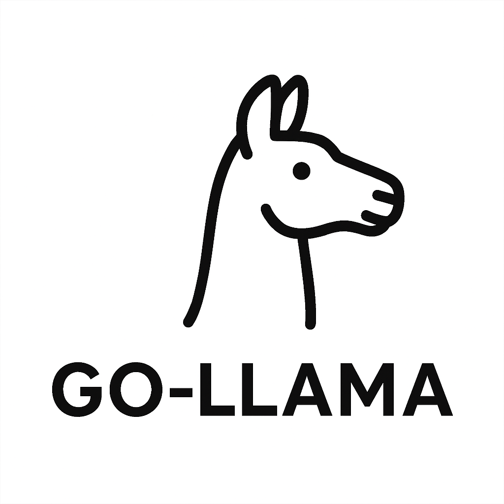

# Go-LLama



---

## Modern Local LLM Chat Web App

Go-LLama is a fully self-hosted, modern chat UI for local LLMs (llama.cpp/llamafile), featuring user authentication, persistent chat history, live streaming, and optional web search via SearxNG.  
**Deploy on your own hardware, scale as needed, and keep your data private.**

---

## Features

- **Local LLM chat:** Connects to llama.cpp/llamafile and compatible APIs.  
- **User authentication:** JWT-based login, admin/user roles, session expiry.
- **Persistent chat history:** Each user gets private chat history, can rename/delete chats.
- **Live streaming:** WebSocket-powered, tokens/sec display, stop button.
- **Web search integration:** Toggle SearxNG results in chat for up-to-date answers.
- **User management:** Admins can add/edit/delete users; users manage their own accounts.
- **Responsive front-end:** Bootstrap UI, mobile-friendly, tooltips, icons, transitions.
- **Configurable subpath:** Deploy under any subpath (default: `/go-llama`).
- **Dockerized database & cache:** PostgreSQL, Redis via Docker Compose.
- **OpenAPI spec:** See [openapi/openapi.yaml](openapi/openapi.yaml) for full API documentation.

---

## Quickstart

1. **Clone this repo:**
    ```sh
    git clone https://github.com/YOUR_USERNAME/go-llama.git
    cd go-llama
    ```

2. **Copy & edit config:**
    ```sh
    cp config.sample.json config.json
    # Edit config.json for your setup (see comments inside)
    ```

3. **Start database & cache:**
    ```sh
    docker compose up -d
    ```

4. **Run backend:**
    ```sh
    go run ./cmd/server/main.go
    ```
    Or build:
    ```sh
    go build -o go-llama-backend ./cmd/server
    ./go-llama-backend
    ```

5. **Open in browser:**  
   Visit `http://localhost:8070/go-llama` (or your configured subpath).

---

## Documentation

- [Setup Guide](SETUP.md)
- [Manual Testing](MANUAL_TESTING.md)
- [Security Hardening](HARDENING.md)
- [API Spec](openapi/openapi.yaml)
- [Project State & Progress](PROJECT_STATE.md)
- [Code Review Tracker](CODE_REVIEW_TRACKER.md)

---

## Configuration

- See [`config.sample.json`](config.sample.json) for a template.
- **Do not commit `config.json` with secrets!**  
  Use `.gitignore` (already included).

---

## License

MIT License (see [LICENSE](LICENSE))

---

## Credits

- **Created by:** [TheFozid](https://github.com/TheFozid)
- **Copilot & Documentation:** [GitHub Copilot](https://github.com/features/copilot), @copilot

---

## Contributing

PRs, issues, and suggestions welcome!  
Open an issue or discussion for questions, bugs, or feature requests.

---

## Screenshot


---

> Deploy, chat, and power up your local LLMs with Go-LLama!
